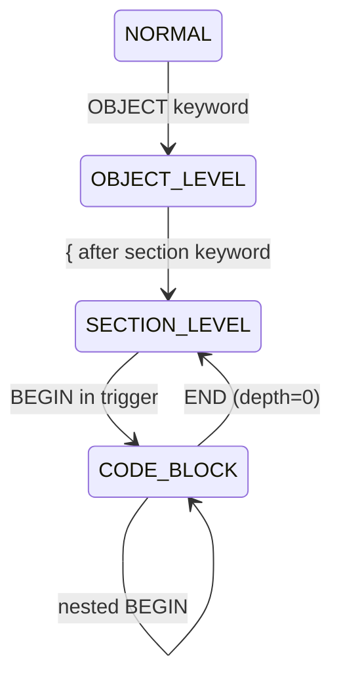

# Lexer Validation & Debug System Proposal

**Created:** 2026-01-14
**Status:** Proposal
**Context:** After achieving 100% parser validation success, exploring systematic lexer quality measurement

---

## Motivation

The parser validation report (`validation-report.md`) proved highly effective because it provided:
- Clear success metric (100% of files parse)
- Specific targets (exact file and line with error)
- Immediate feedback (run script, see number change)
- Complete scope (all 7,677 real NAV files)
- Binary clarity (parses or doesn't)

**Goal:** Create similar systematic validation for the lexer to catch tokenization bugs, context corruption, and performance issues.

**Challenge:** Unlike the parser, the lexer doesn't have explicit errors - it always produces *something*, even if subtly wrong.

---

## Proposed Solutions

### Option 1: Round-Trip Verification

**Concept:** Perfect tokenization should allow source reconstruction.

**Mechanism:**
```typescript
1. Tokenize file → tokens[]
2. Reconstruct: join all token.value strings
3. Compare: reconstructed === original?
4. If not, token boundaries are wrong
```

**Report Format:**
```markdown
## Round-Trip Verification
- **Total files:** 7,677
- **Perfect reconstruction:** 7,650/7,677 (99.65%)
- **Failed reconstruction:** 27 files

### Failed Round-Trips
| File | Issue | Location |
|------|-------|----------|
| COD1234.TXT | Characters missing | Position 423-429 |
| TAB5678.TXT | Character duplication | Line 85, column 12 |
```

**What It Catches:**
- Token boundary bugs
- Missing characters (gaps in tokenization)
- Duplicated characters (overlapping tokens)
- Whitespace handling issues
- Off-by-one errors in position tracking

**Strengths:**
- Objective: Either matches or doesn't
- No interpretation needed
- Catches subtle position bugs

**Limitations:**
- Doesn't show *why* it failed
- Can't distinguish different types of errors

---

### Option 2: Context Stack Health

**Concept:** Lexer maintains context state (PROPERTY, FIELD, CODE_BLOCK, etc.). Should exit every file with clean state.

**Mechanism:**
```typescript
1. Tokenize file, track context stack
2. At EOF, stack should be empty (or default state)
3. Report files with corrupted context exits
```

**Report Format:**
```markdown
## Context Stack Health
- **Total files:** 7,677
- **Clean exits:** 7,610/7,677 (99.13%)
- **Context corruption:** 67 files

### Context Corruption Issues
| File | Exit State | Expected | Details |
|------|------------|----------|---------|
| TAB5218.TXT | PROPERTY | DEFAULT | Context never popped |
| COD422.TXT | CODE_BLOCK (depth=2) | DEFAULT | Unclosed blocks |
```

**What It Catches:**
- Context leaks (enter but never exit)
- Unbalanced context push/pop
- State machine bugs
- Forgotten context resets

**Strengths:**
- Detects state corruption
- Shows specific context problems
- Catches cascading failures

**Limitations:**
- Doesn't show where corruption started
- May hide earlier bugs

---

### Option 3: Token Coverage Analysis

**Concept:** Every character in source should belong to exactly one token.

**Mechanism:**
```typescript
1. Build character map: source[i] → token_index
2. Check: every char covered once?
3. Report gaps (untokenized) or overlaps (double-tokenized)
```

**Report Format:**
```markdown
## Token Coverage
- **Total characters:** 223,456,789
- **Coverage:** 98.5% (219,876,543 chars)
- **Gaps:** 3,580,246 chars (1.5%)
- **Files with gaps:** 117

### Coverage Issues
| File | Issue Type | Location | Details |
|------|------------|----------|---------|
| COD422.TXT | Gap | Line 85, chars 12-17 | Not tokenized |
| TAB123.TXT | Overlap | Line 42, char 23 | Tokenized twice |
```

**What It Catches:**
- Characters that fall through tokenization
- Overlapping token boundaries
- Position calculation errors
- Token boundary bugs

**Strengths:**
- Precise character-level analysis
- Shows exact positions
- Catches gaps and overlaps

**Limitations:**
- High detail may obscure patterns
- Doesn't explain root cause

---

### Option 4: Performance Profiling

**Concept:** Tokenization should be fast. Slowdowns indicate inefficiency or backtracking.

**Mechanism:**
```typescript
1. Time each file's tokenization
2. Report outliers (>100ms)
3. Track total time and average
4. Compare against baseline
```

**Report Format:**
```markdown
## Performance Profile
- **Total files:** 7,677
- **Total time:** 2.3s
- **Average:** 0.3ms/file
- **Median:** 0.2ms/file
- **Outliers (>10ms):** 12 files

### Performance Outliers
| File | Time | Avg Multiple | Lines | Chars | Time/Line |
|------|------|--------------|-------|-------|-----------|
| PAG9504.TXT | 247ms | 824x | 1,234 | 45,678 | 0.20ms |
| COD422.TXT | 89ms | 297x | 2,345 | 89,012 | 0.04ms |

### Performance Regression Detection
- **Baseline (commit abc123):** 2.1s
- **Current (commit def456):** 2.3s
- **Regression:** +9.5%
```

**What It Catches:**
- Exponential backtracking in regex
- Inefficient algorithms
- Performance regressions
- Pathological cases

**Strengths:**
- Prevents performance degradation
- Identifies optimization targets
- Tracks improvements over time

**Limitations:**
- Depends on hardware consistency
- Doesn't identify correctness issues

---

### Option 5 (RECOMMENDED): Combined Health Report

**Concept:** Combine round-trip verification and context health for comprehensive automated validation.

**Why These Two:**
- Round-trip catches tokenization correctness
- Context health catches state machine bugs
- Together cover most lexer failure modes
- Both produce binary pass/fail results
- Minimal overlap in what they detect

**Report Format:**
```markdown
# C/AL Lexer Health Report

**Generated:** 2026-01-14T22:30:00.000Z

## Summary
- **Total files:** 7,677
- **Total lines:** 4,376,238
- **Perfect tokenization:** 7,603/7,677 (99.04%)
- **Files with issues:** 74
- **Tokenization time:** 2.3s

## Health Metrics

### Round-Trip Verification
- **Perfect reconstruction:** 7,650/7,677 (99.65%)
- **Failed reconstruction:** 27 files
- **Characters affected:** 3,421 chars across 27 files

### Context Stack Health
- **Clean context exits:** 7,610/7,677 (99.13%)
- **Context corruption:** 67 files
- **Most common:** PROPERTY context leak (34 files)

### Performance
- **Average time:** 0.3ms/file
- **Median time:** 0.2ms/file
- **Outliers (>10ms):** 12 files
- **Slowest:** PAG9504.TXT (247ms)

## Files Requiring Attention

| File | Round-Trip | Context Health | Performance | Priority |
|------|------------|----------------|-------------|----------|
| TAB5218.TXT | ✅ OK | ❌ PROPERTY leak | ✅ 0.8ms | HIGH |
| COD422.TXT | ❌ Gap at 423 | ✅ OK | ⚠️ 247ms | HIGH |
| PAG9504.TXT | ✅ OK | ✅ OK | ❌ 247ms | MEDIUM |
| TAB1234.TXT | ❌ Overlap | ❌ CODE_BLOCK | ✅ 1.2ms | CRITICAL |

## Error Distribution by Type

### Round-Trip Failures (27 files)
| Error Type | Count | Example Files |
|------------|-------|---------------|
| Missing characters | 15 | COD422.TXT, TAB789.TXT |
| Character duplication | 8 | PAG123.TXT |
| Whitespace handling | 4 | REP456.TXT |

### Context Corruption (67 files)
| Context Type | Count | Example Files |
|--------------|-------|---------------|
| PROPERTY leak | 34 | TAB5218.TXT, TAB6000.TXT |
| CODE_BLOCK depth | 18 | COD1234.TXT |
| FIELD state stuck | 15 | TAB9999.TXT |

## Trend Analysis (Last 10 Commits)

| Commit | Success Rate | Round-Trip | Context Health | Avg Time |
|--------|--------------|------------|----------------|----------|
| abc123 | 98.5% | 99.2% | 97.8% | 2.1s |
| def456 | 98.8% | 99.4% | 98.2% | 2.2s |
| current | 99.04% | 99.65% | 99.13% | 2.3s |

📈 **Progress:** +0.54 points since baseline
⚠️ **Regression:** +9.5% time increase

---

**Command:** `npm run lexer:health`
```

**Implementation:**
```typescript
// server/scripts/lexer-health.ts
interface HealthResult {
  file: string;
  roundTrip: {
    passed: boolean;
    missingChars?: number;
    position?: number;
  };
  contextHealth: {
    passed: boolean;
    exitState?: string;
    expectedState?: string;
  };
  performance: {
    time: number;
    isOutlier: boolean;
  };
}

function validateLexer(file: string): HealthResult {
  const source = readFileSync(file, 'utf-8');
  const startTime = performance.now();

  const lexer = new Lexer(source);
  const tokens = lexer.tokenize();

  const time = performance.now() - startTime;

  // Round-trip test
  const reconstructed = tokens.map(t => t.value).join('');
  const roundTripPassed = reconstructed === source;

  // Context health test
  const contextPassed = lexer.contextStack.length === 0;

  return {
    file,
    roundTrip: {
      passed: roundTripPassed,
      missingChars: source.length - reconstructed.length,
      position: findFirstDifference(source, reconstructed)
    },
    contextHealth: {
      passed: contextPassed,
      exitState: lexer.currentContext,
      expectedState: 'DEFAULT'
    },
    performance: {
      time,
      isOutlier: time > 10
    }
  };
}
```

---

## Option 6: Debug Trace (Klaus's Idea)

**Concept:** Generate detailed trace showing every lexer decision with position and context transitions.

**Key Insight:** Enables **prediction-based debugging**:
1. Read C/AL source
2. Predict what trace should look like
3. Compare to actual trace
4. Find divergence point = bug location

**Format:**
```
[1:1-1:6] 'OBJECT' → Object (keyword)
[1:7-1:7] ' ' → skip (whitespace)
[1:8-1:12] 'Table' → Table (keyword)
[context: DEFAULT → OBJECT_HEADER]
[1:14-1:18] '50000' → Number (literal)
[1:20-1:24] '"Test"' → QuotedIdentifier (quoted, contains: Test)
[1:25-1:25] '{' → LeftBrace (structural)
[context: OBJECT_HEADER → SECTION_LEVEL, braceDepth: 0→1]
[2:3-2:12] 'PROPERTIES' → Properties (section keyword)
[context: SECTION_LEVEL → PROPERTY, inPropertyValue: false→false]
[2:13-2:13] '{' → LeftBrace (structural)
[context: PROPERTY, braceDepth: 1→2, inPropertyValue: false→false]
[3:5-3:8] 'Date' → Identifier (property name)
[3:9-3:9] '=' → Equals (property assignment)
[context: PROPERTY, inPropertyValue: false→true]
[3:10-3:19] '01/13/26' → String (date literal)
[context: PROPERTY, inPropertyValue: true→true]
[3:20-3:20] ';' → Semicolon (property terminator)
[context: PROPERTY, inPropertyValue: true→false]
[4:3-4:3] '}' → RightBrace (structural)
[context: PROPERTY → SECTION_LEVEL, braceDepth: 2→1]
...
```

**Trace Elements:**
1. **Position:** `[line:startCol-line:endCol]` - exact character range
2. **Input:** `'actual text'` - what was consumed (quoted for visibility)
3. **Token type:** `→ TokenType` - result of classification
4. **Category:** `(keyword/literal/identifier/structural/skip)` - semantic role
5. **Context changes:** `[context: OLD → NEW, flags...]` - state transitions
6. **Skip reasons:** `skip (whitespace/comment/etc.)` - why ignored

**Critical Details to Log:**
- **All context state changes** (where bugs hide)
- **Flag changes:** `inPropertyValue`, `inFieldDef`, etc.
- **Depth tracking:** `braceDepth`, `parenDepth`, `bracketDepth`
- **Mode switches:** Property name vs value, field columns, etc.

**Implementation:**
```typescript
class Lexer {
  private debugTrace: string[] = [];
  private readonly TRACE_ENABLED = process.env.LEXER_TRACE === 'true';

  private trace(message: string): void {
    if (this.TRACE_ENABLED) {
      this.debugTrace.push(message);
    }
  }

  private emitToken(type: TokenType, value: string, category: string): Token {
    const token = { type, value, line, column, ... };

    if (this.TRACE_ENABLED) {
      this.trace(
        `[${token.line}:${token.column}-${token.line}:${token.column + value.length - 1}] ` +
        `'${value}' → ${type} (${category})`
      );
    }

    return token;
  }

  private updateContext(newContext: Context): void {
    if (this.TRACE_ENABLED && newContext !== this.currentContext) {
      const flags = [
        `braceDepth: ${this.oldDepth}→${this.braceDepth}`,
        `inPropertyValue: ${this.wasInProp}→${this.inPropertyValue}`
      ].filter(Boolean).join(', ');

      this.trace(`[context: ${this.currentContext} → ${newContext}${flags ? ', ' + flags : ''}]`);
    }

    this.currentContext = newContext;
  }

  public getTrace(): string {
    return this.debugTrace.join('\n');
  }
}
```

**Usage:**
```bash
# Generate trace for specific file
LEXER_TRACE=true npm run lexer:trace test/REAL/TAB5218.TXT > TAB5218-trace.txt

# Or via script
npm run lexer:trace test/REAL/TAB5218.TXT
```

**Workflow Example:**

**Problem:** TAB5218.TXT has "PROPERTY context leak" from health report

**Step 1:** Read source file
```cal
PROPERTIES
{
  Date=01/13/26;
  CaptionML=[ENU=Swift Code];  // "Code" keyword inside property!
}
FIELDS
{
  ...
}
```

**Step 2:** Predict trace
```
[context: SECTION_LEVEL → PROPERTY]
...
[3:13-3:24] '[ENU=Swift Code]' → String
[context: PROPERTY, inPropertyValue: true→false]
[4:1-4:1] '}' → RightBrace
[context: PROPERTY → SECTION_LEVEL]  // Should exit PROPERTY here
[5:1-5:6] 'FIELDS' → Fields (section keyword)
[context: SECTION_LEVEL → FIELD]  // Should enter FIELD
```

**Step 3:** Compare actual trace
```
[context: SECTION_LEVEL → PROPERTY]
...
[3:13-3:17] '[ENU=' → String
[3:18-3:21] 'Code' → Code (keyword)  // ❌ Tokenized as keyword!
[context: PROPERTY → CODE_BLOCK]  // ❌ Wrong context change!
[3:22-3:22] ']' → ...
[context: CODE_BLOCK, stuck here...]  // ❌ Never exits
```

**Step 4:** Root cause identified
Section keyword "Code" inside property value triggered context change. Missing `inPropertyValue` guard.

**Fix:**
```typescript
case TokenType.Code:
  if (!this.inPropertyValue) {  // Add guard
    this.currentContext = Context.CODE_BLOCK;
  }
  break;
```

---

## Option 7 (ULTIMATE): Combined Health Report + Debug Trace

**Concept:** Use automated health report to find problems, debug trace to diagnose them.

**Two-Tier System:**

### Tier 1: Automated Health Report (Fast)
- Run on all 7,677 files
- Identifies problematic files
- Shows overall health metrics
- Tracks trends over time
- **Command:** `npm run lexer:health`

### Tier 2: Debug Trace (On-Demand)
- Run on specific files with issues
- Shows exact lexer decisions
- Enables prediction-based debugging
- Pinpoints exact bug location
- **Command:** `npm run lexer:trace <file>`

**Workflow:**

1. **Run health report:** `npm run lexer:health`
   ```
   Files with issues: 74
   - TAB5218.TXT: Context leak (PROPERTY)
   - COD422.TXT: Round-trip failed (char 423)
   ```

2. **Generate trace for failing file:** `npm run lexer:trace test/REAL/TAB5218.TXT`

3. **Claude reads source and predicts trace**

4. **Compare predicted vs actual trace**

5. **Identify divergence point** = exact bug location

6. **Fix bug**

7. **Re-run health report** - verify file count decreased

**Benefits:**
- **Systematic:** Health report finds all issues
- **Precise:** Debug trace diagnoses each one
- **Efficient:** Only trace files that need investigation
- **Repeatable:** Re-run after every fix
- **Measurable:** Track progress to 100%

**Comparison to Parser Validation:**

| Aspect | Parser Validation | Lexer Validation (Combined) |
|--------|-------------------|------------------------------|
| Success metric | Parse errors | Round-trip + context health |
| Specificity | File + line number | File + exact character position |
| Diagnosis | Error message | Debug trace showing decisions |
| Automation | Fully automated | Health automated, trace on-demand |
| Coverage | All real files | All real files |
| Feedback loop | Run → fix → run | Health → trace → fix → health |

---

## Implementation Plan

### Phase 1: Round-Trip Verification (Minimal)
**Effort:** Small
**Value:** High
**Deliverable:**
- Add `reconstructSource()` method to Lexer
- Create `scripts/lexer-roundtrip.ts`
- Generate report showing reconstruction success rate
- **Milestone:** First lexer quality metric established

### Phase 2: Context Health Check
**Effort:** Small
**Value:** High
**Deliverable:**
- Add `getContextState()` method to Lexer
- Extend script to check context at EOF
- Add context health to report
- **Milestone:** Combined health report complete

### Phase 3: Debug Trace System
**Effort:** Medium
**Value:** Very High
**Deliverable:**
- Add `LEXER_TRACE` environment flag
- Instrument all `emitToken()` calls
- Log context state changes
- Create `scripts/lexer-trace.ts`
- **Milestone:** On-demand diagnostic capability

### Phase 4: Performance Profiling (Optional)
**Effort:** Small
**Value:** Medium
**Deliverable:**
- Add timing to validation script
- Report outliers and regressions
- **Milestone:** Performance tracking enabled

### Phase 5: Trend Tracking & Baselines
**Effort:** Medium
**Value:** High
**Deliverable:**
- Store results in `lexer-health-history/`
- Compare current vs baseline
- Generate trend graphs
- **Milestone:** Continuous quality monitoring

---

## NPM Scripts

```json
{
  "scripts": {
    "lexer:health": "ts-node scripts/lexer-health.ts",
    "lexer:trace": "ts-node scripts/lexer-trace.ts",
    "lexer:roundtrip": "ts-node scripts/lexer-roundtrip.ts",
    "lexer:context": "ts-node scripts/lexer-context.ts",
    "lexer:perf": "ts-node scripts/lexer-performance.ts"
  }
}
```

---

## Success Criteria

### Short-term (After Phase 3)
- [ ] Health report generated for all 7,677 files
- [ ] Round-trip success rate measured
- [ ] Context health measured
- [ ] Debug trace available for any file
- [ ] First batch of issues identified and fixed

### Medium-term (After iteration)
- [ ] 99%+ round-trip success rate
- [ ] 99%+ context health
- [ ] All critical files (standard NAV objects) at 100%
- [ ] Trend tracking showing improvement

### Long-term (Ultimate goal)
- [ ] 100% round-trip success
- [ ] 100% context health
- [ ] Zero performance outliers
- [ ] Continuous monitoring in CI/CD

---

## Open Questions

1. **Should round-trip include whitespace exactly, or normalize it?**
   - Exact: More strict, catches whitespace bugs
   - Normalized: More forgiving, focuses on content

2. **What should "clean context exit" mean?**
   - Empty stack?
   - Default context?
   - Allow certain contexts at EOF?

3. **Should we track token type distribution?**
   - Could catch "too many Unknown tokens" issues
   - Might reveal tokenization patterns

4. **Should traces be saved or generated on-demand?**
   - Saved: Can compare before/after fixes
   - On-demand: Lower disk usage, always fresh

5. **Should we have a "lexer test suite" for known-good files?**
   - Like parser regression tests but for lexer
   - Could include expected traces

---

## References

- Parser validation tool: `server/scripts/validate-real.ts`
- Parser validation report: `validation-report.md`
- Lexer implementation: `server/src/lexer/lexer.ts`
- Token types: `server/src/lexer/tokens.ts`

---

## Next Steps

1. **Review this proposal** - decide which options to implement
2. **Start with Phase 1** - round-trip verification (quick win)
3. **Iterate based on findings** - adapt approach as we learn
4. **Build toward combined system** - health report + debug trace

---

**Note:** This is a proposal. Nothing is implemented yet. All options remain on the table for discussion and refinement.

---

## Appendix: Architect Review Feedback

**Date:** 2026-01-14
**Reviewer:** Architect Agent (Opus)

### Executive Summary

This is a well-structured proposal that correctly identifies the fundamental challenge: unlike parsers, lexers produce output even when subtly wrong. The proposed two-tier approach (automated health report + on-demand debug trace) is architecturally sound and mirrors successful patterns in compiler infrastructure. The proposal demonstrates strong understanding of the lexer's complexity, particularly around context state management.

---

### Critical Analysis

#### Strengths of the Proposal

**1. Correct Problem Framing**

The proposal accurately identifies that lexer validation requires different metrics than parser validation. The observation that "the lexer doesn't have explicit errors - it always produces *something*" is the key insight that drives the entire design.

**2. Complementary Metrics Selection**

Combining round-trip verification with context health is an excellent choice:
- Round-trip catches *tokenization correctness* (character-level)
- Context health catches *state machine correctness* (semantic-level)
- Together they cover the two main failure modes of the C/AL lexer

**3. The Debug Trace Concept**

The "prediction-based debugging" workflow is particularly insightful. Having Claude (or a developer) predict what the trace *should* look like and compare to actual output is a powerful debugging technique that leverages the deterministic nature of lexers.

**4. Incremental Implementation Plan**

The phased approach (round-trip first, then context, then trace, then performance) allows for quick wins and early validation of the approach.

---

### Technical Concerns and Recommendations

#### Issue 1: Round-Trip Reconstruction May Be Insufficient

**Problem:** The proposal assumes `tokens.map(t => t.value).join('')` reconstructs the source. However, examining the lexer implementation:

1. **Comments are not tokenized** - `scanLineComment()` and `scanBlockComment()` consume content but do not emit tokens
2. **Whitespace is not tokenized** - `skipWhitespace()` advances position without emitting tokens
3. **Newlines are not tokenized** - `handleNewLine()` updates line/column but does not emit tokens

**Impact:** Round-trip will always fail because whitespace/comments are intentionally discarded.

**Recommendation:** Modify the round-trip approach to use token position information:

```typescript
function validateRoundTrip(source: string, tokens: Token[]): boolean {
  // Check that every character is covered by exactly one token
  // OR is whitespace/comment (which are intentionally skipped)

  let lastEnd = 0;
  for (const token of tokens) {
    // Gap between tokens should be whitespace/comments only
    const gap = source.slice(lastEnd, token.startOffset);
    if (!isWhitespaceOrComment(gap)) {
      return false; // Unexpected gap
    }

    // Token value should match source at that position
    const actual = source.slice(token.startOffset, token.endOffset);
    if (actual !== token.value) {
      return false; // Position mismatch
    }

    lastEnd = token.endOffset;
  }
  return true;
}
```

This approach validates position accuracy without requiring whitespace/comment tokens.

#### Issue 2: Context Stack Visibility

**Problem:** The proposal references `lexer.contextStack` and `lexer.currentContext`, but the context stack is **private**. The health report implementation would need public accessors.

**Recommendation:** Add minimal public accessors to the lexer:

```typescript
/** Get current context state for debugging/validation */
public getContextState(): {
  stack: LexerContext[];
  depth: number;
  current: LexerContext;
  flags: {
    braceDepth: number;
    bracketDepth: number;
    inPropertyValue: boolean;
    fieldDefColumn: FieldDefColumn;
  };
} {
  return {
    stack: [...this.contextStack],
    depth: this.contextStack.length,
    current: this.getCurrentContext(),
    flags: {
      braceDepth: this.braceDepth,
      bracketDepth: this.bracketDepth,
      inPropertyValue: this.inPropertyValue,
      fieldDefColumn: this.fieldDefColumn
    }
  };
}
```

This preserves encapsulation while enabling validation.

#### Issue 3: Definition of "Clean Context Exit"

**Problem:** Open Question #2 asks what "clean context exit" should mean. Looking at the lexer initialization, the "clean" state is well-defined: stack contains exactly `[NORMAL]` and all tracking flags are reset.

**Recommendation:** Define clean exit explicitly:

```typescript
interface CleanExitCriteria {
  contextStack: ['NORMAL'];  // Exactly one element
  braceDepth: 0;
  bracketDepth: 0;
  inPropertyValue: false;
  fieldDefColumn: FieldDefColumn.NONE;
  currentSectionType: null;
}
```

Deviations from this indicate state corruption.

#### Issue 4: Trace Performance Overhead

**Problem:** The proposal suggests using an environment variable `LEXER_TRACE=true` to enable tracing. However, checking `this.TRACE_ENABLED` on every token emission adds overhead even when tracing is disabled.

**Recommendation:** Use compile-time dead code elimination:

```typescript
// Option A: Build-time flag
const TRACE_ENABLED = process.env.NODE_ENV === 'development' && process.env.LEXER_TRACE === 'true';

// Option B: Separate tracing lexer class
class TracingLexer extends Lexer {
  private debugTrace: string[] = [];

  protected override emitToken(...): Token {
    const token = super.emitToken(...);
    this.trace(...);
    return token;
  }
}
```

Option B is cleaner as it completely separates tracing concerns.

#### Issue 5: Missing "Token Type Distribution" Analysis

**Problem:** Open Question #3 asks about tracking token type distribution. This is valuable but understated.

**Recommendation:** Add explicit metrics:

```typescript
interface TokenDistribution {
  total: number;
  byType: Map<TokenType, number>;
  unknownCount: number;
  unknownPercent: number;
  suspiciousPatterns: SuspiciousPattern[];
}

interface SuspiciousPattern {
  type: string;
  description: string;
  count: number;
  examples: { file: string; line: number; value: string }[];
}
```

Suspicious patterns to detect:
- High `Unknown` token rate (>0.1%)
- Consecutive `Unknown` tokens (indicates systematic failure)
- `Unknown` tokens containing recognizable syntax (missed keyword/operator)
- Identifier tokens that look like keywords (context protection failures)

---

### Additional Recommendations

#### Recommendation 1: Differential Trace Comparison

**Concept:** When debugging a specific file, show the trace *difference* between current and previous versions.

**Value:** Makes regressions immediately visible - you see exactly what changed.

**Implementation:**

```typescript
// Store baseline traces in test/fixtures/traces/
// npm run lexer:trace-diff TAB5218.TXT
// Shows: lines where trace differs from baseline
```

#### Recommendation 2: Snapshot Testing for Lexer

**Concept:** Like Jest snapshots but for token sequences.

**Value:** Catches unexpected tokenization changes during refactoring.

**Implementation:**

```typescript
// test/lexer/__tests__/tokenization.snapshot.test.ts
describe('Lexer Snapshots', () => {
  it('should tokenize TAB_Customer correctly', () => {
    const tokens = tokenize(fixture);
    expect(tokens).toMatchSnapshot();
  });
});
```

This is lower-effort than full traces and integrates with existing test infrastructure.

#### Recommendation 3: Integration with Existing Performance Infrastructure

**Problem:** The proposal mentions performance profiling but does not reference the existing `perf:*` scripts in package.json.

**Recommendation:** Integrate lexer health metrics into the existing benchmark suite at `server/src/__tests__/performance/benchmarks/lexer.bench.ts`:

```typescript
// Add to lexer.bench.ts
bench.add('Lexer: Health check all fixtures', () => {
  for (const fixture of ALL_FIXTURES) {
    const result = validateLexerHealth(fixture);
    if (!result.passed) {
      throw new Error(`Lexer health check failed: ${result.file}`);
    }
  }
});
```

This makes lexer health part of the continuous benchmarking workflow.

#### Recommendation 4: Context Transition Diagram Generation

**Concept:** Automatically generate a state diagram from trace output.

**Value:** Visual representation of context transitions makes patterns obvious.

**Implementation:**

```typescript
// npm run lexer:trace --diagram TAB5218.TXT
// Outputs: Mermaid diagram of context transitions
```



#### Recommendation 5: Regression Prevention via CI

**Concept:** Run health report on every PR, fail if metrics regress.

**Implementation:**

```yaml
# .github/workflows/lexer-health.yml
- name: Check Lexer Health
  run: npm run lexer:health --ci
  # Exits non-zero if success rate < baseline
```

This prevents regressions from reaching main.

---

### Answers to Open Questions

**Question 1: Should round-trip include whitespace exactly?**

**Recommendation:** No. Use position-based validation instead. Exact whitespace matching would require tokenizing whitespace, which adds complexity and memory overhead for limited benefit. Position validation catches all the same bugs without requiring output changes.

**Question 2: What should "clean context exit" mean?**

**Recommendation:** Exactly the initialized state: `contextStack = [NORMAL]`, all tracking flags reset. This is already well-defined in the lexer's `tokenize()` method.

**Question 3: Should we track token type distribution?**

**Recommendation:** Yes, but focus on anomaly detection rather than raw counts. Track `Unknown` tokens, consecutive unusual patterns, and potential keyword misclassifications.

**Question 4: Should traces be saved or generated on-demand?**

**Recommendation:** Both. Generate on-demand for active debugging, but save "golden" traces for key test files as regression baselines.

**Question 5: Should we have a "lexer test suite" for known-good files?**

**Recommendation:** Yes. Create a small curated set (10-20 files) covering all context transitions and edge cases. Include expected token counts and context traces. This becomes the lexer's regression test suite, complementing the full 7,677-file validation.

---

### Implementation Priority Adjustment

Based on the technical analysis, recommended phasing:

| Phase | Original | Recommended |
|-------|----------|-------------|
| 1 | Round-trip verification | **Position-based validation** (fixes the whitespace issue) |
| 2 | Context health check | Context health check (unchanged, but add public accessors first) |
| 3 | Debug trace system | **Snapshot testing** (lower effort, higher immediate value) |
| 4 | Performance profiling | Debug trace system (moved later - more complex) |
| 5 | Trend tracking | Performance integration with existing suite |
| 6 | (new) | CI integration for regression prevention |

---

### Risk Assessment

| Risk | Likelihood | Impact | Mitigation |
|------|------------|--------|------------|
| Round-trip fails on all files due to whitespace | High | High | Use position-based validation instead |
| Trace output too verbose to analyze | Medium | Medium | Implement filtering and diff modes |
| Performance overhead in production | Low | High | Use separate TracingLexer class |
| False positives in health report | Medium | Medium | Curate baseline exclusions for known edge cases |
| Maintenance burden of traces | Medium | Low | Snapshot testing is lower maintenance than full traces |

---

### Conclusion

The proposal is architecturally sound and addresses a real gap in lexer quality assurance. The main technical issue is the round-trip approach, which needs modification to account for whitespace and comments. With the recommended adjustments, this system would provide comprehensive lexer validation that rivals the successful parser validation workflow.

The two-tier design (automated health report + on-demand trace) is the right architecture. It balances systematic coverage with diagnostic depth. The prediction-based debugging workflow is particularly valuable for complex state machine issues like context corruption.

**Overall Assessment:** Approve with modifications. Start with position-based validation and context health, add snapshot testing for quick wins, defer full trace system to later phase.

---

## Appendix: Adversarial Review Feedback

**Date:** 2026-01-14
**Reviewer:** Adversarial Reviewer (Opus)

### Review Context

Examined:
1. The proposal document including architect's review
2. The actual lexer implementation at `server/src/lexer/lexer.ts`
3. Token definitions at `server/src/lexer/tokens.ts`
4. Existing validation script at `server/scripts/validate-real.ts`
5. Existing lexer tests and benchmarks

---

## CRITICAL Issues

### 1. Round-Trip Reconstruction Is Fundamentally Broken

**Location:** Option 1, Option 5, Option 7, Phase 1 Implementation

**Problem:** The proposal's round-trip mechanism (`tokens.map(t => t.value).join('')`) cannot work as described. The architect partially identified this but underestimated its severity.

**Attack Vector:** Looking at the actual lexer implementation:

1. **Comments are consumed but not tokenized** - `scanLineComment()`, `scanBlockComment()`, and `scanCStyleComment()` advance through input but emit no tokens (or emit `Unknown` only on error).

2. **Whitespace is consumed but not tokenized** - `skipWhitespace()` advances position without creating tokens.

3. **Newlines are consumed but not tokenized** - `handleNewLine()` advances position without creating tokens.

4. **The Token interface does NOT store whitespace** - `Token` stores `value`, but this is the semantic content, not including surrounding whitespace.

**Severity Reasoning:** The proposed implementation at lines 319 (`tokens.map(t => t.value).join('')`) will produce output like `OBJECTTable18Customer{PROPERTIES{CaptionML=ENU=Customer;}}` for any file - 100% failure rate guaranteed.

**Fix Direction:** The architect's position-based validation approach is correct but their pseudocode is incomplete. Need to:
- Handle comments specially (they're consumed but produce no tokens)
- Account for the fact that positions may have gaps even in correctly tokenized files
- Consider that `endOffset` semantics need verification (is it inclusive or exclusive?)

---

### 2. Context Stack Is Private With No Public Accessor

**Location:** Phase 2 (Context Health Check), Option 5 implementation code

**Problem:** The proposal's implementation code references `lexer.contextStack` and `lexer.currentContext` directly, but the context stack is private.

**Attack Vector:** Any implementation of the context health check will fail to compile:
```typescript
const contextPassed = lexer.contextStack.length === 0;  // TypeScript error: Property 'contextStack' is private
```

**Severity Reasoning:** This is a compile-time failure that prevents the entire Phase 2 from being implemented without modifying the Lexer class first.

**Fix Direction:** The architect suggested adding `getContextState()` but didn't account for the fact that `LexerContext` is also private (an enum inside the lexer file, not exported). Need to:
1. Either export `LexerContext` enum
2. Or return string representations of context states
3. Update the proposal to include lexer modifications as a prerequisite

---

### 3. "Clean Exit" Definition Is Wrong

**Location:** Open Question #2, Architect's Answer

**Problem:** The architect states clean exit means `contextStack = [NORMAL]`. But at EOF, **the context stack is NOT necessarily `[NORMAL]`**. A well-formed `OBJECT Table 18 { ... }` file will exit with context stack containing at least `OBJECT_LEVEL` because:
- `OBJECT` keyword pushes `OBJECT_LEVEL`
- Closing `}` only pops `SECTION_LEVEL`

**Attack Vector:** Any file that starts with `OBJECT` will report as "context corruption" even if perfectly valid.

**Severity Reasoning:** This could cause false positives on ALL 7,677 files, rendering the context health check useless.

**Fix Direction:** Need to analyze what the ACTUAL expected end state should be:
- What does `braceDepth` equal after parsing a complete file?
- What contexts SHOULD remain on the stack?
- Should we check `contextUnderflowDetected` flag instead?

---

## SERIOUS Concerns

### 4. Performance Profiling Has Fatal Measurement Methodology Issues

**Location:** Option 4, Phase 4, performance sections throughout

**Problem:** The proposal suggests timing with `performance.now()` at file granularity, but:

1. **JIT warmup not considered** - First few files will be slower due to V8 optimization
2. **No consideration of GC pauses** - A GC cycle during timing skews results
3. **No mention of Node.js event loop interference**
4. **"100ms outlier" threshold is arbitrary** - No baseline established

**Attack Vector:** The proposal shows a file taking "247ms" as an outlier. But this could be:
- A legitimate performance bug
- A GC pause during that particular file
- JIT deoptimization due to monomorphic to polymorphic transition
- File system caching effects (first read vs cached read)

**Severity Reasoning:** Without proper methodology, performance data will be noisy and misleading, potentially causing investigation of false positives or missing real issues.

**Fix Direction:**
- Run warmup passes (existing benchmarks do this)
- Use median rather than mean for "typical" performance
- Detect and exclude GC-affected samples
- Establish baseline with statistical significance testing
- Consider using the existing benchmark infrastructure in `server/src/__tests__/performance/`

---

### 5. Trace System Memory Explosion

**Location:** Option 6 (Debug Trace), Phase 3

**Problem:** The proposal suggests storing trace as `string[]` in the lexer:
```typescript
private debugTrace: string[] = [];
```

For a 10,000-line file, this could generate 50,000+ trace entries. Each entry is ~100-200 bytes.

**Attack Vector:**
- 50,000 entries * 150 bytes = 7.5MB per file trace
- Multiple files in memory = potential OOM
- String concatenation creates garbage for GC

**Severity Reasoning:** This could crash the tool when debugging large files, or significantly slow down the LSP server if trace is accidentally enabled in production.

**Fix Direction:**
- Stream trace to file instead of memory
- Add size limits with early cutoff
- Use structured logging (JSON objects) for better compression
- The architect's suggestion of separate `TracingLexer` class is good but doesn't address memory

---

### 6. REAL Files Access Patterns Risk

**Location:** Throughout proposal, references to test/REAL/

**Problem:** The proposal assumes running against 7,677 files in `test/REAL/`. According to the CLAUDE.md context:
- These are proprietary NAV objects (gitignored)
- "Never copy content to test/fixtures/ or any committed file"

**Attack Vector:**
1. The generated health report (proposed to be saved as markdown) could contain excerpts from REAL files
2. Trace output for debugging could be committed accidentally
3. Error messages quoting file content could leak proprietary data

Example from proposal's report format:
```markdown
| COD422.TXT | Gap at 423 | Line 85, chars 12-17 | Not tokenized |
```

If the "Not tokenized" column expands to show WHAT wasn't tokenized, proprietary code leaks.

**Severity Reasoning:** Legal/compliance risk if proprietary NAV code is committed to a public repository.

**Fix Direction:**
- Report should reference file:line:column only, never content
- Trace output should go to gitignored location
- Add explicit warnings in tool output about confidentiality
- Consider sanitization step before any file writes

---

### 7. Token Position Invariant Not Verified

**Location:** Architect's suggested position-based validation

**Problem:** The architect assumes `token.startOffset` and `token.endOffset` correctly track positions. The `endOffset` is calculated at each call site differently.

Looking at test expectations, for a 3-character token starting at 0, `endOffset` is 3, meaning it's EXCLUSIVE (half-open interval `[start, end)`).

**Attack Vector:** If any code path calculates `endOffset` incorrectly (as inclusive), position validation would fail on those tokens, potentially masking as "tokenization bugs" when it's actually position tracking bugs.

**Severity Reasoning:** Position-based validation is proposed as THE primary correctness check. If position tracking itself is buggy, the entire validation approach is unreliable.

**Fix Direction:**
- Add explicit tests that verify `input.slice(startOffset, endOffset) === token.value` for all token types
- Document the interval semantics in `tokens.ts`
- Verify ALL code paths in lexer use consistent semantics

---

## Potential Issues

### 8. Report Prioritization Algorithm Undefined

**Location:** Option 5 report format "Priority" column

**Problem:** The report shows:
```markdown
| TAB1234.TXT | X Overlap | X CODE_BLOCK | OK 1.2ms | CRITICAL |
```

How is "CRITICAL" vs "HIGH" vs "MEDIUM" calculated? No algorithm is specified.

**Severity Reasoning:** Minor inconsistency, but could cause confusion when triaging issues.

**Fix Direction:** Define explicit priority calculation:
- CRITICAL: Round-trip AND context both fail
- HIGH: Either round-trip OR context fails
- MEDIUM: Only performance outlier
- LOW: Minor issues (if tracked)

---

### 9. CI Integration Failure Mode Unclear

**Location:** Architect's Recommendation 5 (CI Integration)

**Problem:** The architect suggests:
```yaml
- name: Check Lexer Health
  run: npm run lexer:health --ci
  # Exits non-zero if success rate < baseline
```

But "baseline" is undefined:
- Is it the previous commit?
- Is it stored in a file?
- What if baseline doesn't exist (new clone)?
- What's the tolerance for regression (0.01%? 1%?)?

**Severity Reasoning:** CI flakiness causes developer frustration and slows down development.

**Fix Direction:**
- Define baseline storage location and format
- Define behavior when baseline missing (pass with warning? bootstrap?)
- Define regression tolerance with clear reasoning

---

### 10. Trend Analysis Scalability

**Location:** Option 5 "Trend Analysis" section, Phase 5

**Problem:** The proposal shows trend analysis over "Last 10 Commits". But:
- Where is this data stored?
- At what granularity? (per-file results would be 7,677 * N commits)
- How is commit association handled (commit hashes change with rebasing)?
- Storage in `lexer-health-history/` would accumulate indefinitely

**Attack Vector:** After a year of development with daily commits, the history directory could contain 365 files with 7,677 * 365 = 2.8 million data points, causing:
- Slow trend generation
- Large repository size
- Complex merge conflicts

**Severity Reasoning:** Technical debt that grows over time.

**Fix Direction:**
- Define data retention policy (last N commits, or time-based)
- Store only aggregate statistics per commit, not per-file details
- Consider database storage instead of flat files

---

## Suggestions

### 11. Missing Consideration: Parser Health Report Interaction

The proposal doesn't address how lexer health interacts with the existing parser validation (`validate-real.ts`). Questions:
- Should lexer health run first (as a prerequisite)?
- Can parser errors help diagnose lexer issues (or vice versa)?
- Should there be a combined "C/AL Health" report?

### 12. Snapshot Testing Underspecified

The architect recommends snapshot testing but doesn't address:
- Snapshot format (JSON? Custom?)
- Snapshot update workflow
- How to handle intentional tokenization changes
- Snapshot size management (full token stream could be large)

### 13. Debug Trace Format Could Be Machine-Readable

The proposed trace format is human-readable but not machine-parseable. Consider also generating:
- JSON format for programmatic analysis
- Line-oriented format for `grep`/`awk` processing
- Diff-friendly format for baseline comparison

### 14. Missing Error Recovery Validation

The lexer silently handles various error conditions (unclosed strings, unclosed comments, etc.) by emitting `TokenType.Unknown`. The proposal doesn't validate that error recovery:
- Produces reasonable position tracking
- Doesn't corrupt context state
- Allows continued parsing

### 15. No Mention of Encoding Handling

Looking at `validate-real.ts`, it uses `readFileWithEncoding`. The proposal doesn't mention:
- What encodings are in REAL files?
- How encoding affects position tracking (multi-byte characters)
- Whether trace should show byte offsets or character offsets

---

## Summary Assessment

The proposal is fundamentally sound in its goals and overall architecture. The two-tier approach (automated health + on-demand trace) is the right design. However, there are several implementation landmines that will cause the first implementation to fail:

1. **Round-trip mechanism as written will not work** - 100% failure rate guaranteed
2. **Context stack accessibility requires lexer changes first** - compile-time blocker
3. **Clean exit definition is wrong** - potential false positive flood

The architect's review caught the first issue but didn't fully address the second and completely missed the third. The remaining issues are real but more manageable.

**Recommendation:** Before implementation, add a **"Phase 0: Lexer API Extensions"** that:
1. Exports necessary types (`LexerContext` or a public equivalent)
2. Adds `getContextState()` method
3. Documents and tests position tracking invariants
4. Verifies what "clean exit" actually means by examining successful parses

Only after Phase 0 validates assumptions should Phase 1-5 proceed.

**Overall Assessment:** Approve architecture, reject current implementation plan. Require Phase 0 prerequisite work before proceeding.
